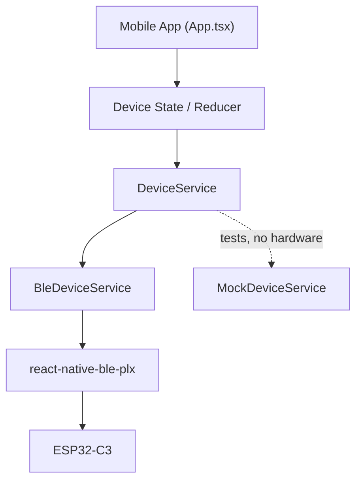

# OhmSense Mobile


## Overview

OhmSense Mobile is the mobile application of the OhmSense system. It is built with
React Native, Expo and TypeScript, currently targets Android, and talks to an
ESP32-C3 peripheral over Bluetooth Low Energy.

From the app you can connect to the device, request a measurement on demand and
read the resistance, battery level and charging status.

> **Prototype.** The application is implemented and exchanges real BLE packets,
> but the ESP32-C3 firmware used at this stage is a **test firmware that generates
> simulated values**. Nothing shown in the app is a real measurement yet.

## Features

- Bluetooth Low Energy device discovery
- Device connection
- GATT service and characteristic discovery
- On-demand measurements
- Resistance display
- Battery percentage
- Charging status
- Charge time
- Runtime Bluetooth permissions
- Error handling
- Mock device mode

## Demo

The following video shows the OhmSense mobile application communicating with an
ESP32-C3 device over Bluetooth Low Energy.

The ESP32-C3 used in this demonstration generates simulated values for
resistance, battery level, charging status and charge time.

https://github.com/leandrogrzn/OhmSense_Project/raw/main/OhmSense/docs/Video_prueba.mp4

## Architecture



`DeviceService` is the only seam between the UI and the transport. During tests
`MockDeviceService` replaces `BleDeviceService`, so the app can run end to end
without an ESP32-C3 present and without touching the native BLE module.

## BLE Communication

OhmSense Mobile communicates with the ESP32-C3 through Bluetooth Low Energy
(BLE).

The application scans for the OhmSense device, establishes a connection and
discovers the required GATT service and characteristics. Once connected, the
mobile app can request a measurement and receive the resulting data from the
device.

The BLE communication is organized around three main operations:

- **Connection:** discovers and connects to the OhmSense ESP32-C3 peripheral.
- **Measurement:** sends a measurement request to the device.
- **Data reception:** receives measurement results and device status through BLE
  notifications.

The application also handles Bluetooth permissions, connection timeouts and
communication errors to provide appropriate feedback to the user.

The BLE implementation is isolated in `src/services/ble/`, while the
`DeviceService` abstraction allows the same application state and UI to operate
with either the real BLE backend or the mock backend used during development.

The peripheral advertises as `OhmSense` and exposes one custom service with four
128-bit vendor UUIDs (no Bluetooth SIG registration).

| Component | UUID |
|---|---|
| Service | `7b4f1000-6a5e-4d91-9c2a-8f4e5b3d2101` |
| DATA | `7b4f1001-6a5e-4d91-9c2a-8f4e5b3d2101` |
| COMMAND | `7b4f1002-6a5e-4d91-9c2a-8f4e5b3d2101` |
| STATUS | `7b4f1003-6a5e-4d91-9c2a-8f4e5b3d2101` |

**Requesting a measurement.** Write `0x01` to `COMMAND`. The write carries no
data: the result arrives as a `DATA` notification, or the request fails when
`STATUS` reports an error.

**DATA packet — 9 bytes, integers little-endian.**

| Offset | Size | Field | Unit |
|---|---|---|---|
| 0 | 1 | version (`0x01`) | — |
| 1–4 | 4 | resistance, `uint32` | micro-ohms |
| 5 | 1 | battery | percent |
| 6 | 1 | charging flag | non-zero = charging |
| 7–8 | 2 | charge time, `uint16` | minutes |

`STATUS` communicates the device state (ready, measuring, result ready, error).

**Timeouts.** Scan: 10 s · connection and discovery: 15 s · measurement: 5 s.

**Android permissions.** API ≥ 31 requests `BLUETOOTH_SCAN` and
`BLUETOOTH_CONNECT`; API ≤ 30 requests `ACCESS_FINE_LOCATION`, which the platform
requires to return scan results.

## Project Structure

```
OhmSense/
├── src/
│   ├── components/
│   ├── constants/
│   ├── services/
│   │   ├── ble/
│   │   └── mock/
│   ├── state/
│   ├── types/
│   └── utils/
├── App.tsx
├── app.json
├── package.json
└── README.md
```

## Tech Stack

| Component | Version |
|---|---|
| Expo | `~57.0.25` |
| React Native | `0.86.3` |
| React | `19.2.3` |
| TypeScript | `~6.0.3` |
| Package manager | Bun |
| BLE library | `@sfourdrinier/react-native-ble-plx` `3.9.3` |

## Setup

### Install dependencies

```bash
bun install
```

### Run the app

```bash
bun start          # Metro / Expo dev server
bun run android    # open on a connected device or emulator
```

BLE requires a native development build: `react-native-ble-plx` is a native
module, so Expo Go cannot load it. Build a development client against the
Android project in `android/` with:

```bash
bunx expo run:android
```

### Mock mode

To run the UI without hardware, set the backend selector in
`src/constants/config.ts`:

```ts
export const deviceServiceMode: DeviceServiceMode = "mock";
```

`MockDeviceService` then replaces `BleDeviceService` and the app runs in Expo Go.