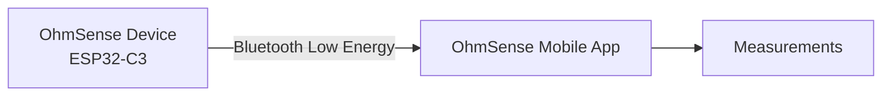
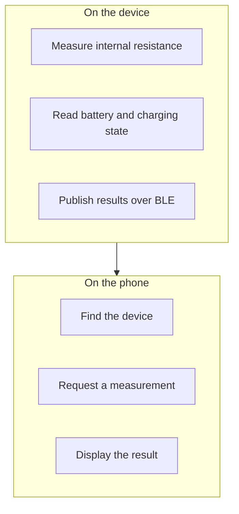

# OhmSense

A portable resistance-measurement system built around an ESP32-C3 device and a mobile app.

---

## About

**OhmSense** is a portable system for measuring the internal resistance of a battery.

The goal is to develop a small, battery-powered device capable of measuring the internal resistance of a cell. The measurement will be sent to a mobile application over Bluetooth Low Energy, allowing the result to be viewed wirelessly.

The system has two halves that work together:

- **The device** — a small ESP32-C3 board that will perform the measurement and broadcast the result over Bluetooth Low Energy.
- **The mobile app** — an Android application written with Expo and React Native that discovers the device, requests a measurement, and displays the result.

Think of the device as the sensor and the app as the display. Neither one is useful alone: the hardware will provide the measurement, and the app will make it readable.

---

## System Overview

The device advertises itself over BLE. The app scans for it, connects, asks for a measurement, and renders the result on screen.

---

## Components

| Component | What it is | State |
|---|---|---|
| **Firmware** | ESP32-C3 firmware acting as a Bluetooth Low Energy peripheral | Test version — publishes simulated values |
| **Mobile app** | Android app built with Expo and React Native | Implemented, covered by automated tests |
| **Constant-current circuit** | Schematic and simulation of the measurement source | Simulated in LTspice only |

### Firmware

The firmware runs on an ESP32-C3 and acts as a BLE peripheral. It responds to measurement requests from the app and publishes readings over a Bluetooth characteristic.

The current firmware is a **test version**: instead of reading real hardware, it generates simulated resistance, battery and charging values. This lets the whole app be developed and tested end to end before the analog front end exists.

### Mobile app

The app is a single-screen Android application. It scans for nearby devices, connects, requests a measurement, and displays the result. It includes a mock mode, so the interface can be explored without any hardware nearby.

### Analog front end

The constant-current source used to measure resistance exists today as a schematic and an LTspice simulation. There is no hardware yet and no firmware driving it.

---

## Tech Stack

| Layer | Technology |
|---|---|
| Device | ESP32-C3 |
| Wireless | Bluetooth Low Energy (GATT) |
| Mobile app | Expo, React Native, React |
| Language | TypeScript |
| Simulation | LTspice |

The BLE library is `@sfourdrinier/react-native-ble-plx`, a maintained fork of `react-native-ble-plx` that supports the Android permissions this project needs.

---

## Current Status

The project is a **prototype**. Here is honestly what exists and what does not.

**Working today**

- Mobile app implemented and type-safe, with an automated test suite.
- Real BLE communication: the app can discover, connect to, and exchange data with a peripheral.
- ESP32-C3 firmware that advertises over BLE and publishes readings.
- A mock device mode for working on the app without hardware.
- A simulated constant-current circuit in LTspice.

**Not implemented yet**

- The ADS1220 analog front end. No ADC hardware or driver code exists in this repository.
- Reading a real battery. Battery and charging values are currently simulated.
- Real charging management.
- Physical hardware for the measurement circuit.

**Planned next**

- Hardware bring-up for the measurement circuit.
- Replacing the simulated firmware values with real measurements.
- Integrating the ADS1220.

---

## Authors

- **Cristian Albarracín**
- **Leandro José Garzón Nieto**

---